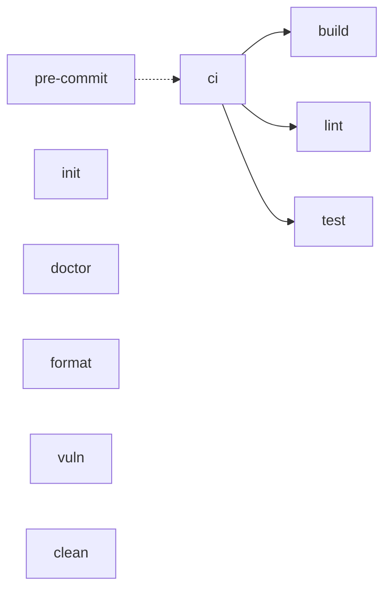

# Makefile Reference

The [`Makefile`](./Makefile) is the single source of truth for building, linting
and testing ghx. Humans, agents and CI run the same targets, so a green
`make ci` locally means the same checks CI runs. Run `make help` for the quick
target list; this file is the narrative reference.

## Target overview

Solid arrows are hard prerequisites, run in order (`build`, then `lint`, then
`test`). The dotted arrow is an alias (`pre-commit` runs `ci`). The remaining
targets stand alone.

## Targets

### Develop

| Target | Description |
|--------|-------------|
| `help` | List targets (the default goal) |
| `init` | `go mod download`; `INSTALL_PACKAGES=1` also installs golangci-lint |
| `doctor` | Check the dev environment with `triage` against `triage.yaml`; `MODE=default\|release` |
| `build` | `go build -o bin/ghx ./cmd/ghx` |
| `lint` | gofmt drift, `go mod tidy -diff`, `go vet`, `golangci-lint run`; fails when golangci-lint is missing |
| `format` | `gofmt -w .`, `golangci-lint fmt` (when installed), `go mod tidy` |
| `test` | `go test -race -cover ./...` |
| `vuln` | `go tool govulncheck ./...` (govulncheck is a `tool` dependency in `go.mod`) |
| `ci` | `build`, `lint`, `test`: the full pre-push gate |
| `pre-commit` | Alias of `ci` |
| `clean` | Remove `bin/` and `dist/` |

### GitHub

| Target | Description |
|--------|-------------|
| `gh-runs-list` | List in-flight Actions runs (`status != completed`) |
| `gh-runs-watch` | Watch in-flight runs until each completes |
| `gh-runs-status` | Last completed run per workflow: `success` is a green check, `skipped` and `neutral` a dim dash, anything else a red cross |

`GH_LIMIT` (default 50) caps how many recent runs are fetched. A `gh` failure
(for example, not logged in) prints a warning and exits 0.

## `make init`: idempotent bootstrap

`make init` is safe to re-run at any time. It runs `go mod download`. With
`INSTALL_PACKAGES=1` it also installs golangci-lint at `GOLANGCI_LINT_VERSION`
into `$(go env GOPATH)/bin`, but only when `golangci-lint` is not already on
`PATH`. It never touches an existing install.

## `make doctor`

Read-only. Runs `triage` against [`triage.yaml`](./triage.yaml), which checks
`git`, `go` (against the version in [`.go-version`](./.go-version)), `gh` and
`golangci-lint`. `MODE=release` adds `goreleaser`. A missing tool is a reported
result from triage, not a Makefile error. Install triage with
`brew install lolay/tap/triage`.

## `make lint` and `make format`

`format` rewrites source formatting and `go.mod` / `go.sum`; `lint` has a
check-only twin for each, so a commit made without `make format` fails CI.
Lint rules live in [`.golangci.yml`](./.golangci.yml), whose header lists the
linters left out for now and why. `GOLANGCI_LINT_VERSION` in the Makefile is
the pinned version; the CI install step must use the same value.

## CI map

Placeholder: the workflow to target map lands with the CI workflow in plan B.
